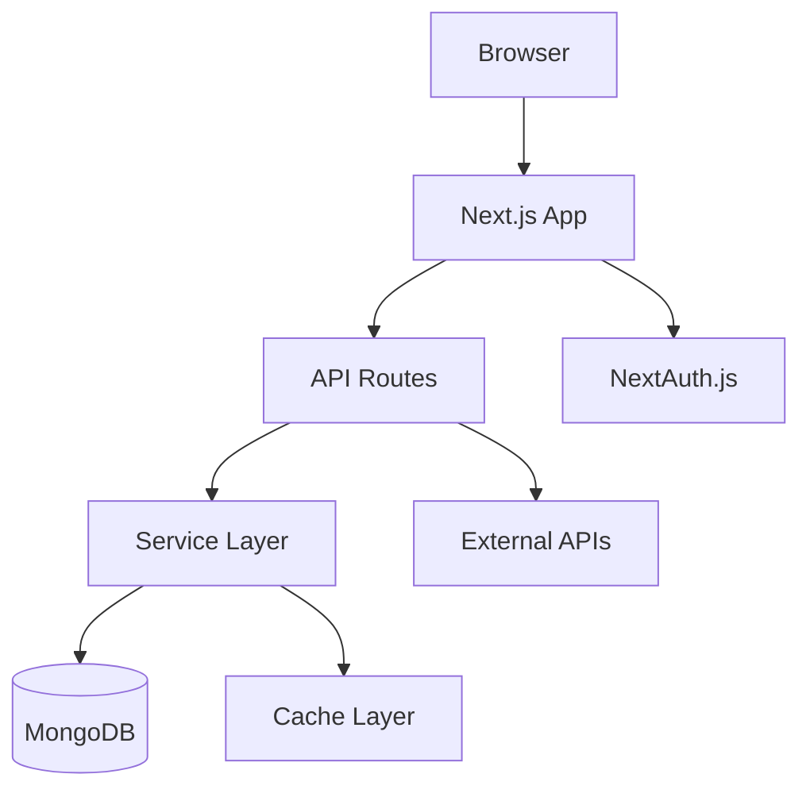

# ReviewMe Technical Documentation

## Table of Contents
1. [System Overview](#system-overview)
2. [Architecture](#architecture)
3. [Authentication & Security](#authentication--security)
4. [Database Schema](#database-schema)
5. [API Endpoints](#api-endpoints)
6. [Component System](#component-system)
7. [Validation Framework](#validation-framework)
8. [Feature Modules](#feature-modules)
9. [Performance & Optimization](#performance--optimization)
10. [Deployment & Configuration](#deployment--configuration)

---

## System Overview

### Project Description
ReviewMe is a comprehensive professional profile platform built as a Progressive Web Application (PWA) that analyzes GitHub profiles, LinkedIn data, and resumes using ML-powered recommendations.

### Technology Stack
- **Frontend**: Next.js 15 + React 18 + TypeScript
- **Backend**: Next.js API Routes + Express.js Server
- **Database**: MongoDB with custom ODM
- **Authentication**: NextAuth.js (Credentials, GitHub, Google)
- **Styling**: Tailwind CSS + shadcn/ui
- **State Management**: Zustand + TanStack Query
- **Testing**: Jest + Playwright + Testing Library
- **Performance**: Lighthouse CI + Web Vitals
- **PWA**: next-pwa with Workbox

### Core Features
- Multi-step onboarding system
- GitHub/LinkedIn/Resume analysis
- Credit-based economy with referrals
- Advanced analytics dashboard
- Blog content aggregation
- Real-time notifications
- Public profile pages

---

## Architecture

### High-Level Architecture


### Service Layer Pattern
```typescript
// Core Services Architecture
- CreditService: Credit management and validation
- RequestLogService: Request/response tracking  
- AnalyticsService: User activity monitoring
- ReferralService: Referral code management
- ValidationService: Input validation
- BlogService: Content aggregation
```

### Directory Structure
```
src/
├── app/                    # Next.js App Router
│   ├── api/               # API endpoints
│   ├── dashboard/         # Dashboard pages
│   └── u/[username]/      # Public profiles
├── components/            # React components
├── lib/                   # Core services
└── types/                 # TypeScript definitions
```

---

## Authentication & Security

### Authentication Configuration
```typescript
// src/lib/auth.ts
export const authOptions: NextAuthOptions = {
  adapter: MongoDBAdapter(clientPromise),
  providers: [
    CredentialsProvider({
      async authorize(credentials) {
        const user = await db.users.findOne({ email: credentials.email });
        if (user && await bcrypt.compare(credentials.password, user.password)) {
          return { id: user._id, email: user.email, name: user.name };
        }
        return null;
      }
    }),
    GitHubProvider({ clientId: process.env.GITHUB_ID!, clientSecret: process.env.GITHUB_SECRET! }),
    GoogleProvider({ clientId: process.env.GOOGLE_CLIENT_ID!, clientSecret: process.env.GOOGLE_CLIENT_SECRET! })
  ],
  session: { strategy: 'jwt' },
  callbacks: {
    async jwt({ token, user, account }) {
      if (account && user) {
        token.accessToken = account.access_token;
        token.provider = account.provider;
      }
      return token;
    }
  }
};
```

### Security Headers
```typescript
// src/lib/security.ts
export const securityHeaders = {
  'Content-Security-Policy': [
    "default-src 'self'",
    "script-src 'self' 'unsafe-eval'",
    "style-src 'self' 'unsafe-inline' https://fonts.googleapis.com",
    "img-src 'self' data: https: blob:",
    "connect-src 'self' https://api.github.com"
  ].join('; '),
  'X-Content-Type-Options': 'nosniff',
  'X-Frame-Options': 'DENY',
  'X-XSS-Protection': '1; mode=block'
};
```

### Rate Limiting
```typescript
// Different limits for different endpoints
const rateLimits = {
  general: { windowMs: 15 * 60 * 1000, max: 100 },
  auth: { windowMs: 15 * 60 * 1000, max: 5 },
  upload: { windowMs: 60 * 60 * 1000, max: 10 }
};
```

---

## Database Schema

### Core Collections
```typescript
// User Document Schema
interface UserDocument {
  _id?: string;
  name: string;
  email: string;
  password?: string;
  credits: number; // Default: 100
  referralCode?: string;
  publicUsername?: string;
  onboardingCompleted: boolean;
  isFirstTimeLogin: boolean;
  requestCounts: {
    github: number;
    linkedin: number;
    resume: number;
  };
  onboardingData?: OnboardingData;
  createdAt: Date;
  updatedAt: Date;
}

// Request Tracking Schema
interface UserRequestDocument {
  userId: string;
  serviceType: 'github' | 'linkedin' | 'resume';
  requestPayload: any;
  creditsDeducted: number;
  status: 'pending' | 'processing' | 'completed' | 'failed';
  createdAt: Date;
  completedAt?: Date;
}

// Response Storage Schema  
interface ServiceResponseDocument {
  userId: string;
  requestId: string;
  serviceType: string;
  responseData: any;
  analysisResults?: any;
  processingTime: number;
  createdAt: Date;
}
```

### Database Manager
```typescript
// src/lib/database.ts
export class DatabaseManager {
  private db: Db;

  get users() { return this.db.collection<UserDocument>('users'); }
  get profiles() { return this.db.collection<ProfileDocument>('profiles'); }
  get userRequests() { return this.db.collection<UserRequestDocument>('userRequests'); }
  get serviceResponses() { return this.db.collection<ServiceResponseDocument>('serviceResponses'); }

  async connect(): Promise<void> {
    // Connection with retry logic
  }
}

export const getDbManager = (uri?: string) => new DatabaseManager(uri);
```

---

## API Endpoints

### Authentication Routes
```typescript
// NextAuth Routes
GET/POST /api/auth/[...nextauth]  # NextAuth handler

// Registration
POST /api/auth/register
Body: { name: string, email: string, password: string, referralCode?: string }
Response: { success: boolean, user: UserDocument }
```

### User Management
```typescript
// Profile Management
GET /api/user/profile
Response: { id, name, email, credits, onboardingCompleted }

PUT /api/user/settings  
Body: { name?, bio?, profilePublic?, preferences? }
Response: { success: boolean }
```

### Service Integration
```typescript
// GitHub Analysis
POST /api/github/sync
Body: { username: string }
Response: { success: boolean, data: GitHubAnalysis, creditsUsed: number }

// Resume Upload
POST /api/resume/upload
Body: FormData
Response: { success: boolean, analysis: ResumeAnalysis, creditsUsed: number }
```

### Credit System
```typescript
// Credit Operations
GET /api/credits
Response: { credits: number, lastUpdated: Date }

POST /api/credits
Body: { serviceType: ServiceType }
Response: { sufficient: boolean, cost: number, remaining: number }

// Transaction History
GET /api/credits/history?limit=20
Response: { transactions: Transaction[], summary: Summary[] }
```

### Onboarding System
```typescript
// Onboarding Management
GET /api/onboarding
Response: { completed: boolean, data: OnboardingData | null }

POST /api/onboarding
Body: OnboardingData
Response: { success: boolean, message: string }

PATCH /api/onboarding
Body: Partial<OnboardingData>
Response: { success: boolean }
```

---

## Component System

### Core Component Architecture
```typescript
// Authentication Components
export function OnboardingManager() {
  const { data: session } = useSession();
  const [showOnboarding, setShowOnboarding] = useState(false);

  useEffect(() => {
    if (session?.user && !onboardingCompleted) {
      setShowOnboarding(true);
    }
  }, [session]);

  return showOnboarding ? <OnboardingPopup /> : null;
}
```

### Multi-Step Onboarding
```typescript
// src/components/onboarding-popup.tsx
const STEPS = [
  { id: 'profile', title: 'Profile Information', icon: User },
  { id: 'social', title: 'Social Profiles', icon: Globe },
  { id: 'preferences', title: 'Preferences', icon: Briefcase },
  { id: 'privacy', title: 'Privacy & Consent', icon: Shield },
];

export default function OnboardingPopup({ isOpen, onClose, onComplete }) {
  const [currentStep, setCurrentStep] = useState(0);
  const [formData, setFormData] = useState<OnboardingFormData>({});
  
  const validateCurrentStep = (): boolean => {
    // Step-specific validation logic
    switch (currentStep) {
      case 0: return !!formData.userType;
      case 1: return formData.socialProfiles.github || formData.socialProfiles.linkedin;
      case 3: return formData.consents.dataCollection;
      default: return true;
    }
  };

  return (
    <div className="fixed inset-0 z-50 bg-black/50">
      <div className="max-w-2xl mx-auto bg-white rounded-lg p-6">
        <StepIndicator steps={STEPS} currentStep={currentStep} />
        <StepContent step={currentStep} formData={formData} setFormData={setFormData} />
        <NavigationButtons onNext={handleNext} onPrevious={handlePrevious} />
      </div>
    </div>
  );
}
```

### Credit Management
```typescript
// src/components/credit-manager.tsx
export function CreditManager() {
  const [credits, setCredits] = useState(0);
  const [showReferral, setShowReferral] = useState(false);
  
  const checkCredits = async (serviceType: ServiceType) => {
    const cost = CREDIT_COSTS[serviceType];
    if (credits < cost) {
      setShowReferral(true);
      return false;
    }
    return true;
  };

  return (
    <>
      <div className="credit-display">
        <CreditCard className="h-4 w-4" />
        <span>{credits} Credits</span>
      </div>
      {showReferral && <ReferralPopup onClose={() => setShowReferral(false)} />}
    </>
  );
}
```

---

## Validation Framework

### Comprehensive Validation Service
```typescript
// src/lib/validation-service.ts
export class ValidationService {
  static readonly schemas = {
    github: z.string()
      .url('Must be a valid URL')
      .refine((url) => this.isValidGitHubUrl(url), 'Invalid GitHub URL'),
    
    linkedin: z.string()
      .url('Must be a valid URL')
      .refine((url) => this.isValidLinkedInUrl(url), 'Invalid LinkedIn URL'),
    
    email: z.string()
      .email('Must be a valid email')
      .max(254, 'Email too long'),
    
    name: z.string()
      .min(2, 'Name too short')
      .max(50, 'Name too long')
      .regex(/^[a-zA-Z\s'-]+$/, 'Invalid characters')
  };

  static isValidGitHubUrl(url: string): boolean {
    try {
      const urlObj = new URL(url);
      if (!['github.com', 'www.github.com'].includes(urlObj.hostname.toLowerCase())) {
        return false;
      }
      const pathParts = urlObj.pathname.split('/').filter(Boolean);
      return pathParts.length === 1 && this.isValidGitHubUsername(pathParts[0]);
    } catch {
      return false;
    }
  }

  private static isValidGitHubUsername(username: string): boolean {
    // GitHub username: alphanumeric + hyphens, max 39 chars
    const regex = /^[a-zA-Z0-9]([a-zA-Z0-9-]){0,37}[a-zA-Z0-9]$|^[a-zA-Z0-9]$/;
    return regex.test(username);
  }
}
```

### Form Validation Integration
```typescript
// Usage in components
const validateOnboardingStep = (step: number, data: FormData) => {
  const errors: string[] = [];
  
  switch (step) {
    case 0: // Profile
      if (!data.userType) errors.push('Select user type');
      break;
    case 1: // Social Profiles
      if (data.socialProfiles.github && !ValidationService.isValidGitHubUrl(data.socialProfiles.github)) {
        errors.push('Invalid GitHub URL');
      }
      if (!data.socialProfiles.github && !data.socialProfiles.linkedin) {
        errors.push('Provide at least GitHub or LinkedIn');
      }
      break;
    case 3: // Privacy
      if (!data.consents.dataCollection) {
        errors.push('Data collection consent required');
      }
      break;
  }
  
  return errors;
};
```

---

## Feature Modules

### Credit System Implementation
```typescript
// src/lib/services.ts
export const CREDIT_COSTS = {
  github: 20,
  linkedin: 15,
  resume: 20,
} as const;

export class CreditService {
  static async getUserCredits(userId: string): Promise<number> {
    const db = getDbManager();
    const user = await db.users.findOne({ _id: new ObjectId(userId) });
    return user?.credits || 0;
  }

  static async deductCredits(userId: string, serviceType: ServiceType): Promise<boolean> {
    const db = getDbManager();
    const cost = CREDIT_COSTS[serviceType];
    
    const result = await db.users.updateOne(
      { _id: new ObjectId(userId), credits: { $gte: cost } },
      { $inc: { credits: -cost }, $set: { updatedAt: new Date() } }
    );

    return result.modifiedCount > 0;
  }

  static async checkLowCredits(userId: string): Promise<boolean> {
    const credits = await this.getUserCredits(userId);
    return credits < 20;
  }
}
```

### Request Logging System
```typescript
export class RequestLogService {
  static async logRequest(
    userId: string,
    serviceType: ServiceType,
    payload: any,
    creditsDeducted: number
  ): Promise<string> {
    const db = getDbManager();
    
    const request: UserRequestDocument = {
      userId,
      serviceType,
      requestPayload: payload,
      creditsDeducted,
      status: 'pending',
      createdAt: new Date()
    };

    const result = await db.userRequests.insertOne(request);
    
    // Update user request count
    await db.users.updateOne(
      { _id: new ObjectId(userId) },
      { $inc: { [`requestCounts.${serviceType}`]: 1 } }
    );

    return result.insertedId.toString();
  }

  static async logResponse(
    requestId: string,
    responseData: any,
    analysisResults?: any
  ): Promise<void> {
    const db = getDbManager();
    
    await db.serviceResponses.insertOne({
      requestId,
      responseData,
      analysisResults,
      processingTime: Date.now(),
      createdAt: new Date()
    });

    await db.userRequests.updateOne(
      { _id: new ObjectId(requestId) },
      { $set: { status: 'completed', completedAt: new Date() } }
    );
  }
}
```

### GitHub Analysis Service
```typescript
// src/lib/github-service.ts
export class GitHubService {
  static async analyzeProfile(username: string): Promise<GitHubAnalysis> {
    // Fetch user profile
    const profile = await this.fetchProfile(username);
    
    // Fetch repositories
    const repositories = await this.fetchRepositories(username);
    
    // Calculate comprehensive score
    const score = this.calculateScore(profile, repositories);
    
    return { profile, repositories, score, analyzedAt: new Date() };
  }

  private static calculateScore(profile: any, repositories: any[]): GitHubScore {
    const metrics = {
      repositoryCount: repositories.length,
      averageStars: repositories.reduce((sum, repo) => sum + repo.stargazers_count, 0) / repositories.length,
      languageDiversity: new Set(repositories.map(repo => repo.language).filter(Boolean)).size,
      readmeQuality: repositories.filter(repo => repo.has_readme).length / repositories.length,
      collaborationScore: repositories.filter(repo => repo.forks_count > 0).length / repositories.length
    };

    const overall = (
      Math.min(metrics.repositoryCount * 2, 20) +
      Math.min(metrics.averageStars * 5, 25) +
      Math.min(metrics.languageDiversity * 3, 15) +
      metrics.readmeQuality * 20 +
      metrics.collaborationScore * 20
    );

    return {
      overall: Math.round(overall),
      activity: Math.min(repositories.length * 5, 100),
      quality: metrics.readmeQuality * 100,
      collaboration: metrics.collaborationScore * 100,
      documentation: metrics.readmeQuality * 100,
      consistency: Math.min(metrics.repositoryCount * 5, 100),
      breakdown: metrics
    };
  }
}
```

---

## Performance & Optimization

### Web Vitals Monitoring
```typescript
// src/components/web-vitals-reporter.tsx
export function WebVitalsReporter() {
  useEffect(() => {
    import('web-vitals').then(({ onCLS, onINP, onFCP, onLCP, onTTFB }) => {
      onCLS(sendToAnalytics);
      onINP(sendToAnalytics);
      onFCP(sendToAnalytics);
      onLCP(sendToAnalytics);
      onTTFB(sendToAnalytics);
    });
  }, []);

  const sendToAnalytics = (metric: any) => {
    fetch('/api/analytics', {
      method: 'POST',
      headers: { 'Content-Type': 'application/json' },
      body: JSON.stringify({
        actionType: 'web-vital',
        metadata: { name: metric.name, value: metric.value }
      })
    });
  };

  return null;
}
```

### Caching Strategy
```typescript
// Smart caching with DataCacheService
export class DataCacheService {
  static async getCachedData(userId: string, serviceType: ServiceType) {
    const db = getDbManager();
    
    const cached = await db.serviceResponses
      .findOne(
        { userId, serviceType },
        { sort: { createdAt: -1 } }
      );

    if (cached && this.isFresh(cached.createdAt)) {
      return cached;
    }
    
    return null;
  }

  private static isFresh(date: Date): boolean {
    const FRESHNESS_THRESHOLD = 24 * 60 * 60 * 1000; // 24 hours
    return Date.now() - date.getTime() < FRESHNESS_THRESHOLD;
  }
}
```

### Performance Targets
- **Core Web Vitals**: LCP < 2.5s, FID < 100ms, CLS < 0.1
- **API Response**: p95 < 200ms
- **Bundle Size**: Main < 250KB gzipped
- **Lighthouse Score**: ≥ 90

---

## Deployment & Configuration

### Environment Variables
```bash
# Authentication
NEXTAUTH_SECRET=your-secret
NEXTAUTH_URL=http://localhost:3000

# Database
MONGODB_URI=mongodb://localhost:27017/reviewme

# OAuth Providers
GITHUB_ID=your-github-client-id
GITHUB_SECRET=your-github-client-secret
GOOGLE_CLIENT_ID=your-google-client-id
GOOGLE_CLIENT_SECRET=your-google-client-secret

# External Services
JWT_SECRET=your-jwt-secret
```

### Docker Configuration
```dockerfile
# Dockerfile
FROM node:18-alpine
WORKDIR /app
COPY package*.json ./
RUN npm ci --only=production
COPY . .
RUN npm run build
EXPOSE 3000
CMD ["npm", "start"]
```

### Build Scripts
```json
{
  "scripts": {
    "dev": "next dev",
    "build": "next build",
    "start": "next start",
    "test": "jest",
    "test:e2e": "playwright test",
    "lint": "next lint",
    "analyze": "ANALYZE=true next build"
  }
}
```

This technical documentation provides a comprehensive guide for understanding, implementing, and extending the ReviewMe system. Each section includes practical code examples and implementation details for developers to successfully work with the platform.